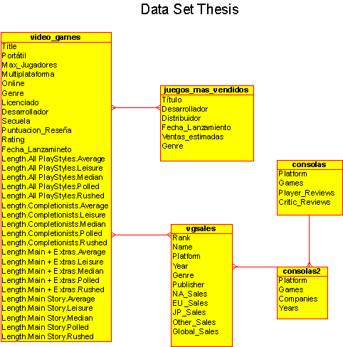

# Obtain information on what type of Genre and Platform Serious Games can be developed
---

---

## Author: Juan Carlos González Ibarra
## E-mail: jcgi.laboral@gmail.com
---

## Developed Date: june, 2023

---

## Content

1. Objectives
2. Development Methodology
3. Data Clean
4. Exploratory Data Analysis
5. Data Modeling
6. Conclusion
7. References

---

---

# 1. Objectives

Oobtain valuable insights that support decision-making in determining the type of 'Genre' and/or 'Platform' for the development of Serious Games.

---

# 2. Development Methodology

To perform an **EDA** and **Data Modeling** that can help **establish the type of Genre and/or Platform for the Serious Games to be developed**, each task will be addressed as follows:

1. Definition of the _Target Variable(s)._

2. Data Cleaning:
   - Data Loading.
   - Data Preprocessing.
   - Remove irrelevant variables.
   - Impute missing values.
   - Clean attribute names that won’t be used.

3. Perform an EDA on the data to understand the distribution of the target variable(s) and variables needed to achieve the project's objective:

   - Correlation Analysis of Global Sales by Console and Genre.
   - Analysis of Global Video Game Sales by Platform.
   - Analysis of Global Sales by Genre.
   - Analysis of Global Sales by Development Company.

4. Generate a Supervised Predictive Model using Algorithms like:
   
   - Prediction: This algorithm is used for prediction. The key difference lies in the type of output variable being predicted.

5. Evaluate the model.

6. Implement the model.

7. Provide feedback on the model.

---

## 2.1 Definition of the Target Variable(s)

**The goal is to classify the 'Game Genre' and 'Platform',** either separately or together, to gather insights on the type of Genre and Platform to develop for Serious Games. Therefore, the correlation, classification, and prediction of the Game Genre and Platform will be based on the **analysis of successful video games**.

The **target variable** will be to determine which game genre and platform will be useful for creating a new successful video game. In this context, the **success of a video game** is defined **by the number of Copies Sold, as represented in the 'Global Sales' attribute**. Thus, the **variables** to be used to achieve the project's **objective** may include:

- **Game Genre:** This variable represents the category or type of game, such as action, adventure, strategy, sports, etc.

- **Platform:** This variable indicates the system or device on which the game will be released and played, such as PlayStation, Xbox, PC, Nintendo Switch, etc.

- **Global Sales:** This variable represents the total worldwide sales of the game. It will be **used as a success measure** to determine **whether a game is successful or not**.

- **Other Variables:** Other relevant variables for the analysis, such as game rating, review scores, development company, release date, etc., may also be considered depending on data availability and relevance to the specific objective.

---

# 3. Data Clean

## 3.1 Descripción de los datos

### In this project, a dataset was obtained through Web Scraping from the following websites:

*   [https://www.mobygames.com](https://www.mobygames.com)
    
*   [https://www.kaggle.com/datasets/sidtwr/videogames-sales-dataset](https://www.kaggle.com/datasets/sidtwr/videogames-sales-dataset)
    
*   [https://www.kaggle.com/datasets/gregorut/videogamesales](https://www.kaggle.com/datasets/gregorut/videogamesales)
    

The datasets are in CSV format and include:

*   consolas.csv
    
*   consolas2.csv
    
*   juegos\_mas\_vendidos.csv
    
*   vgsales.csv
    
*   video\_games.csv
    

The information contained in the CSV files is as follows:

### **consolas.csv & consolas2.csv**:

Contain information about gaming platforms, games developed, and reviews.

*   Attributes:
    
    *   **Platform**: This string attribute describes the name of the gaming console for which the games were developed.
        
    *   **Games\_x**: This integer attribute represents the number of games that have been developed for the specific console represented in the "Platform" column.
        
    *   **Player Reviews**: This integer attribute shows the number of reviews or critiques made by players about the console.
        
    *   **Critic Reviews**: This integer attribute shows the number of reviews made by professional critics about the console.
        
    *   **Companies**: This attribute combines text and integers to show the number of game development companies that have developed titles for the console.
        
    *   **Years**: This is a text string with integer values that indicates the range of years during which the console has been on the market. For example, a value of "2001 - 2020" would indicate that the console was released in 2001 and has been used up until 2020.
        

### **juegos\_mas\_vendidos.csv & vgsales.csv & video\_games.csv**:

Contain information on the best-selling games by platform, genre, etc., and statistics on the average time a player spends playing.

*   Attributes:
    
    *   **Title**: (String) The name of the video game.
        
    *   **Development Company**: (String) The company or studio that developed the video game.
        
    *   **Release Date**: (Int) The date the video game was officially released.
        
    *   **Genre**: (String) The type or category of the game (e.g., action, adventure, strategy, etc.).
        
    *   **Platform**: (String) The system or device on which the game was released and can be played (e.g., PlayStation, Xbox, PC, etc.).
        
    *   **Multiplatform**: (String) An indicator of whether the video game is available on more than one platform.
        
    *   **Portable**: (Bool) An indicator of whether the video game is available on portable platforms (e.g., Nintendo Switch, PSP, etc.).
        
    *   **Online**: (Bool) An indicator of whether the video game has online play functionality.
        
    *   **Max Players**: (Bool) The maximum number of players that can play the video game simultaneously.
        
    *   **Rating**: (Int) The age rating or recommendation for the video game (e.g., E for Everyone, T for Teens, M for Mature, etc.).
        
    *   **Ranking**: (Int) The game's ranking in a list, generally in terms of popularity or sales.
        
    *   **Review Score**: (Float) The average score or rating given to the video game by critics.
        
    *   **Sequel**: (Bool) An indicator of whether the video game is a sequel to a previous game.
        
    *   **Licensed**: (Bool) An indicator of whether the video game is based on an existing license (e.g., a movie, TV show, comic book, etc.).
        
    *   **Sales NA**: (Float) The number of copies of the video game sold in North America.
        
    *   **Sales EU**: (Float) The number of copies of the video game sold in Europe.
        
    *   **Sales JP**: (Float) The number of copies of the video game sold in Japan.
        
    *   **Sales Others**: (Float) The number of copies of the video game sold in other regions of the world.
        
    *   **Global Sales**: (Float) The total number of copies of the video game sold worldwide.
        
    *   **Estimated Sales**: (Float) An estimate of the total number of copies the video game will sell in the future, based on current sales trends.
        
    *   **Length.All PlayStyles.Average**: (Float) Represents the average game duration considering all play styles.
        
    *   **Length.All PlayStyles.Leisure**: (Float) Shows the game duration for players who enjoy the game more casually, covering all play styles.
        
    *   **Length.All PlayStyles.Median**: (Float) The median game duration, taking into account all play styles.
        
    *   **Length.All PlayStyles.Polled**: (Float) The number of observations or samples used to calculate the average game duration for all play styles.
        
    *   **Length.All PlayStyles.Rushed**: (Float) Reflects the game duration for players who progress through the game more quickly, considering all play styles.
        
    *   **Length.Completionists.Average**: (Float) The average game duration for completionist players who aim to achieve 100% of the game.
        
    *   **Length.Completionists.Leisure**: (Float) Shows the game duration for completionist players who play more casually.
        
    *   **Length.Completionists.Median**: (Float) The median game duration for completionist players.
        
    *   **Length.Completionists.Polled**: (Float) The number of observations or samples used to calculate the average game duration for completionists.
        
    *   **Length.Completionists.Rushed**: (Float) Represents the game duration for completionist players who progress through the game more quickly.
        
    *   **Length.Main + Extras.Average**: (Float) Shows the average game duration when playing the main story plus extra content.
        
    *   **Length.Main + Extras.Leisure**: (Float) The game duration for players who enjoy the main story and extra content more casually.
        
    *   **Length.Main + Extras.Median**: (Float) The median game duration, considering the main story and extra content.
        
    *   **Length.Main + Extras.Polled**: (Float) The number of observations or samples used to calculate the average game duration for the main story plus extras.
        
    *   **Length.Main + Extras.Rushed**: (Float) Reflects the game duration for players who progress through the main story and extras more quickly.
        
    *   **Length.Main Story.Average**: (Float) Shows the average duration of the game's main story.
        
    *   **Length.Main Story.Leisure**: (Float) Represents the duration of the game's main story for players who enjoy it more casually.
        
    *   **Length.Main Story.Median**: (Float) The median duration of the game's main story.
        
    *   **Length.Main Story.Polled**: (Float) The number of observations or samples used to calculate the average duration of the main story.
        
    *   **Length.Main Story.Rushed**: (Float) Indicates the duration of the main story for players who progress more quickly through it.
        

### Entity-Relationship Diagram

---

## 3.3 Preprocess the Data
-----------------------

### Merging DataFrames

Two DataFrames (df_consolas and df_consolas2) will be merged. The common attribute is "Platform," which represents the name of the platform on which the video game runs.

Three DataFrames (df_juegos, df_vgsales, df_video_games) will be merged. The common attributes are "Título" in df_juegos, "Name" in df_vgsales, and "Title" in df_video_games, which represent the name of the video game.

### Removing Irrelevant Variables

In the df_consolas DataFrame, the 'Games_y' attribute will be removed because it is a duplicate of 'Games_x'. The remaining attributes will be renamed as follows:

-   'Platform': 'Plataforma'
-   'Companies': 'Compañia'
-   'Games_x': 'Juegos_Desarrollados'
-   'Years': 'Anios'
-   'Player Reviews': 'Resenas_Jugador'
-   'Critic Reviews': 'Cantidad_Criticas'

All null values (NaN) in the DataFrame will be replaced according to the data type as follows:

-   'Plataforma' with 'Desconocido'
-   'Compañia' with 'Desconocido'
-   'Juegos_Desarrollados' with 0
-   'Anios' with 0
-   'Resenas_Jugador' with 0
-   'Cantidad_Criticas' with 0

In the df_juegos DataFrame, a broader data processing will be performed:

-   Null values in the 'Genre_x' column will be replaced with the corresponding values from the 'Genre_y' column.

-   The 'Genre_y' column will be deleted from the DataFrame since the null values in 'Genre_x' have been filled with the corresponding values.

-   The following columns will be removed: 'Fecha_Lanzamiento', 'Unnamed: 11', 'Fecha_Lanzamineto', 'Desarrollador_y', 'Genre', 'Desarrollador_x', and 'Distribuidor'.

-   The columns of the DataFrame will be renamed using a dictionary that specifies the new name for each column.

-   Columns will be reorganized for better clarity.

-   A list called 'columnas' will be defined, containing the names of the columns to be modified, and the iteration over each column in the list will replace their null values.

-   For string-type attributes, empty spaces will be replaced with 'Desconocido'.

-   A list called 'valores_incorrectos' ('2007', '2009', '2010', '2011', '2012', '2013', '2014', '2015') will be defined, containing values to be replaced in the 'Genero' attribute with 'Desconocido'.

-   For int or float-type attributes, empty spaces will be replaced with 0.

-   For bool-type attributes, empty spaces will be replaced with 'False'.

## 4 Exploratory Data Analysis (EDA)

In the exploratory analysis, the DataFrames are analyzed with the information provided in the previous section. The purpose is to analyze and investigate the datasets, summarize their main characteristics, identify relationships, understand the distribution of the target variable(s), and the variables to achieve the project’s objective.

The following is defined:

- #### Global Sales Analysis by Year.
- #### Correlation Analysis of Global Sales by Console and Genre.
- #### Global Sales Analysis of Video Games by Platform.
- #### Global Sales Analysis by Genre.
- #### Global Sales Analysis by Development Company.

---

## 4.1 Global Sales Analysis by Year.

In this analysis, the distribution of global video game sales over the years is examined using the 'Release_Date' attribute, which contains the launch date information, and the 'Global_Sales' attribute, which contains the total global sales of the video game. The relationship between global sales and the year of release is visualized in a line chart.
The goal is to identify patterns or trends in sales over time, such as peaks or declines in certain years. This can help understand the evolution of the video game industry and make strategic decisions based on historical sales.

---

### 6.1.1 Relevant Information:

- The average global sales amount to 500,000 copies over a span of 37 years.
- The highest sales peaks occurred between 2007 and 2008.
- Sales began to increase in 2000 but started declining after 2015.

---

## 4.2 Correlation Analysis of Global Sales by Console and Genre.

We can explore the correlations between the various attributes present in the df_juegos DataFrame to better understand their relationships and select features for data modeling.

The correlation matrix is a table showing the correlation coefficient (also known as Pearson's r) between pairs of variables in a dataset. Each cell of the table displays the correlation between two variables.

The features of the correlation matrix are:

- The correlation coefficient is a statistical measure that describes the degree of relationship between two variables.
- The correlation coefficient ranges from -1 to +1.
- A correlation of +1 indicates a strong positive correlation, meaning the two variables tend to increase together.
- A correlation of -1 indicates a strong negative correlation, meaning that as one variable increases, the other decreases.
- A correlation of 0 indicates no linear relationship between the variables.

---

By visualizing the correlation matrix with a heatmap, one can get a view of how the variables in the df_juegos dataset are correlated.

In the heatmap:

- Colored cells represent the correlations between variables.
- The color of each cell is determined by the correlation value and the color map used.
- Strong correlations (close to 1 or -1) are indicated by more intense colors, while weak correlations (close to 0) are shown with lighter colors.

**A strong positive correlation is observed between 'Global_Sales', 'Ranking', and 'Review_Score', suggesting that video games with higher review scores tend to have more global sales. This implies that the quality of a game (as measured by reviews) may influence its commercial success. However, correlation does not imply causation, and more research is needed to understand the relationship between these variables.**

---

### 4.2.1 Relationship Between Genre and Global Sales**

To delve deeper into the correlation analysis, a graph is generated showing the relationships between three variables: 'Platform', 'Global_Sales', and 'Genre'. The 'Platform' variable is displayed along the x-axis, 'Global_Sales' along the y-axis, and 'Genre' is represented by the color of the points.

Thus, each point on the graph represents a game, and its position on the x and y axes indicates the platform on which the game was released and the global sales it achieved. The color of the point indicates the genre of the game.

The graph shows how global sales vary based on the platform and genre.

---

If points of a specific color (representing a certain genre) are clustered in a specific area of the graph, it suggests that the genre tends to have more sales on certain platforms.

### 4.2.2 Relevant Information:
- **The average global sales for each genre are below 10 million copies, so it's suggested to analyze the average global sales by genre and/or platform.**
- The genres with the highest sales are Action, Racing, Platform, Role Playing, and Shooter.
- The platforms with the highest sales by genre are:
  - Action (Nintendo, PlayStation, and Xbox).
  - Racing (Nintendo, PlayStation, and Xbox).
  - RPG (Nintendo, PlayStation, and Xbox).
  - Shooter (PlayStation and Xbox).

---

## 4.3 Global Sales Analysis of Video Games by Platform.

As a result of the previous correlation analysis, the relationship between 'Global_Sales', 'Genre', and 'Platform' is observed to be below 1 million copies. Therefore, an analysis of the average 'Global_Sales' will be conducted.

This analysis examines the distribution of video game sales according to the platform they are played on, using the 'Platform' attribute (which contains information on the platform) and the 'Global_Sales' attribute (containing the total global sales). The total sales by platform are calculated and visualized in a line chart, highlighting each maximum point in the 'Platform' attribute for the most popular or successful video games in terms of sales. This can help understand the console market and make decisions on developing and distributing games for specific platforms.

---

### 4.3.1 Relevant Information:
- The average global sales per platform are below 1 million copies.
- The total average global sales for all platforms is 548,394 million copies.
- The platforms with the highest sales are Nintendo, PlayStation, and Xbox.

---

## 4.4 Global Sales Analysis by Genre.

In this analysis, the distribution of global video game sales is examined using the 'Genre' attribute (which contains information on the genre of the video game) and the 'Global_Sales' attribute (which contains the total global sales of the video game). The total sales by genre are calculated and visualized in a line chart, highlighting each maximum point in the 'Genre' attribute for the most popular or successful video games in terms of sales. This can provide useful insights for making decisions related to the development and marketing of new games and for understanding players' preferences and interests.

---

### 4.4.1 Relevant Information:
- The average global sales by genre are below 1 million copies.
- The total average global sales for all genres is 548,394 million copies.
- The genres with the highest sales are:
  - Arcade.
  - Sandbox.
  - Platform.
  - Shooter.
  - RPG.
  - Racing.
  - Sports.
  - Action.

---

## 4.5 Global Sales Analysis by Development Company.

This analysis examines the distribution of global video game sales by the company that developed the games, using the 'Development_Company' attribute (which contains information on the company that developed the video game) and the 'Global_Sales' attribute (which contains the total global sales of the video game). The total sales by company are calculated and visualized in a line chart. The goal is to identify which development companies have the most success in terms of video game sales. This can be useful for evaluating the reputation and performance of development companies and for making decisions about partnerships or acquisitions in the industry.

---

### 4.5.1 Relevant Information:

Most development companies have an average global sales below 500,000 copies.
The development companies with the highest sales are:
- Nintendo.
- Electronic Arts.
- Activision.
- Sony.
- Ubisoft.

---

### 4.6 EDA Results

To link the analyses to data modeling, the strengths of each type of analysis are summarized according to the project’s objective:

- **Correlation Analysis of Global Sales by Console and Genre:**

  - The correlation between the attributes in the df_juegos DataFrame can be examined.
  - A positive correlation between 'Global_Sales', 'Ranking', and 'Review_Score' can be identified.
  - Video games with higher review scores tend to have more global sales, which can be used as a target variable to define Serious Games, considering the reviews and ranking that the player can achieve, and how this can enhance the educational experience.
  - In conclusion, this data can be used to determine which genre of video game should be used to develop Serious Games.
  
  
  
- **Global Sales Analysis of Video Games by Platform:**

  - The distribution of video game sales by platform or console can be examined.
  - The most popular platforms in terms of sales can be identified.
  - It is possible to evaluate which platforms are most suitable for Serious Games, considering the technical characteristics and usability required to offer an effective educational experience.
  - In conclusion, this data can be used to determine which platforms should be used to develop and distribute Serious Games.
  
  
  

- **Global Sales Analysis by Genre:**

  - The distribution of video game sales by genre can be examined.
  - The most popular video game genres in terms of sales can be identified.
  - It is possible to evaluate which genres are relevant for Serious Games, considering the educational or informative goal of the game.
  - In conclusion, this data can be used to determine which genre of Serious Games has the highest potential for acceptance and success in the market.
  
  
  

- **Global Sales Analysis by Development Company:**

  - The distribution of video game sales by development company can be examined.
  - The companies with a successful track record in terms of video game sales can be identified.
  - Possible partnerships or collaborations with these companies for the development and distribution of Serious Games can be evaluated.
  - In conclusion, this data can be used to select a development company with experience in the chosen genre and platform.

By combining these analyses, a more comprehensive and data-backed view of the most suitable genre and platform for developing Serious Games can be obtained. These

---

## 5. Data Modeling

Data modeling refers to the process of building algorithms (Machine Learning, Data Science, Big Data, among others) that can make predictions or estimations about future outcomes. In the context of the **_Project Objective_**, the data modeling to be developed is aimed at predicting the success or acceptance of a particular game genre on a specific platform.

To apply predictive data modeling to this hypothesis, the following steps are undertaken:

- **Data Collection**: Obtain a historical dataset containing relevant information about games similar to the Serious Games to be developed. This data should include game characteristics such as genre, platform, sales, reviews, etc.

- **Data Preparation**: Clean and preprocess the data by removing outliers, handling missing data, and performing necessary transformations.

- **Variable Selection**: Identify the variables or characteristics of the game that may influence its success or acceptance. This may include genre, platform, specific game features, demographic data of players, etc.

- **Model Construction**: Select the appropriate machine learning algorithm for the type of problem and available data. Examples may include logistic regression, decision trees, random forests, or neural networks.

- **Model Training**: Use the historical data to train the model, adjusting the algorithm's parameters and optimizing its performance.

- **Model Validation**: Evaluate the model's performance using techniques such as cross-validation or splitting the data into training and testing sets. Measure performance metrics such as accuracy, recall, F1 score, etc.

- **Prediction and Decision-Making**: Use the trained model to make predictions about the success or acceptance of a particular game genre on a specific platform. These predictions can aid in decision-making regarding the type of genre and platform to develop for the Serious Games.

---

## 5.1 Data Collection

The data collected in CSV format are named:
- consolas.csv.
- consolas2.csv.
- juegos_mas_vendidos.csv.
- vgsales.csv.
- video_games.csv.

## 5.2 Data Preparation

There are two resulting DataFrames:
- df_consolas.
- df_juegos.

Based on the Exploratory Data Analysis (EDA), it was concluded that only df_juegos will be used, as it contains information closest to the project's objective.

## 5.3 Variable Selection

The variables to be used for creating the model are:
- 'Genre'.
- 'Platform'.
- 'Global_Sales'.

And their positive correlation with:
- 'Ranking'.
- 'Review_Score'.

---

## 5.4 Model Construction

Based on the analysis of the different results from the EDA, the decision was made to create several "Data Models" in order to achieve a higher success rate toward the project's objective. The models to be created are Supervised Models because they will use a labeled dataset, where the 'Global_Sales' of video games (target variable) are known.

The models to implement:

- Classification Model: to predict the genre category of a video game using the input variables that the **_Random Forest_** classification algorithm will use.

- Linear Regression, which will be used to train the model and adjust the regression coefficients. The selection of this algorithm is because it can find the best straight line that fits the data to predict the target variable. The linear regression model will predict the global sales of video games based on the used variables ('Genre', 'Platform', and 'Development Company'). These variables have characteristics to predict global sales of video games and find possible relationships or patterns between them and global sales.

---

## 5.4.1 Classification Model

The model is defined in the following steps:

- Predict the 'Genre' category.
- Implement the Random Forest algorithm: a powerful and versatile algorithm that can handle both categorical and numerical variables.
- The algorithm will find a decision boundary that separates the different classes in the input variable space.
- The input variables are 'Platform', 'Ranking', 'Review_Score', and 'Global_Sales'.
- The 'Platform' variable is categorical, so it will be encoded using the one-hot encoding process.
- Split the data into training and testing sets.
- Predict the labels for the test data.
- Calculate the model's accuracy.
- Display the classification report.

---

## 5.4.2 Classification Model Results

The results based on the classification report:

- The model's accuracy is approximately 0.23 or 23%, meaning the model correctly predicts the genre of the video game 23% of the time in the test set. Overall, this is not very good.

- The confusion matrix shows how many times each class was predicted correctly or incorrectly. For example, the first row corresponds to the "Action" class. Out of 766 actual action games, the model correctly predicted 275 of them. However, it also incorrectly predicted 48 as "Adventure", 35 as "Fighting", 67 as "Misc", etc.

The classification report provides more details on the model's performance for each class according to the metrics:

- Precision: It is the proportion of positive predictions that were correct; when the model predicts "Action", it is correct 35% of the time.

- Recall: It is the proportion of actual positive cases that were correctly detected; the model detects 36% of the actual action games.

- F1-score: It is a metric that combines precision and recall into a single figure. It is useful when comparing two or more models, especially if you have no specific preference between precision and recall.

- Support: It is the number of occurrences of each class in the test set.

These results suggest that the model has difficulty predicting the genre of video games based on the input variables used. It may be useful to explore other variables, create new features, use another classification algorithm, or adjust the parameters of the current model to try to improve performance.

---

## 5.4.3 Regression Model

The model is defined in the following steps:

- Predict the 'Global_Sales' feature.
- Implement the linear regression algorithm: a statistical approach to modeling the relationship between a dependent variable (or target variable) and one or more independent variables (or features).
- The algorithm will predict 'Global_Sales' based on the features 'Genre', 'Platform', and 'Development_Company'.
- The input variables are 'Genre', 'Platform', and 'Development_Company'.
- Define the features and the target: 'Genre', 'Platform', and 'Development_Company' are features, and 'Global_Sales' is the target.
- Convert categorical features to numerical, using dummy variables to convert these categorical features into numerical.
- Split the data into training and testing sets.
- Create and train the linear regression model.
- Predict global sales for the test set.
- Show results of the prediction model.

---

## 5.4.4 Model Training

The model is trained using the features 'Genre', 'Platform', and 'Development_Company' to predict the global sales of video games. The categorical features are converted to numerical variables before training the model.

The model training process:

- The feature set (X) and the target (y) to be used for training the model are defined. The features (X) are obtained from the DataFrame df_juegos, selecting the columns 'Genre', 'Platform', and 'Development_Company'.

- The target (y) is obtained from the DataFrame df_juegos, selecting the 'Global_Sales' column. The categorical features in X are converted to numerical variables using the one-hot encoding technique via pd.get_dummies(X).

- The data is split into training (X_train, y_train) and testing (X_test, y_test) sets using the train_test_split() function. A test size of 20% is used, and a random seed is set to ensure reproducibility of results.

- A linear regression model object is created using LinearRegression(). The model is trained using the training data (X_train, y_train) via the fit() method.

Variables used:

- X: The feature set used to train the model, including the columns 'Genre', 'Platform', and 'Development_Company' from the df_juegos DataFrame.
- y: The target of the model, corresponding to the global sales of video games (the 'Global_Sales' column in df_juegos).

---

## 5.4.5 Model Validation

The model validation process:

- A new DataFrame called 'new_game' is created to represent a new game with attributes for which we want to predict global sales.
- The categorical attributes of the new game ('Genre', 'Platform', 'Development_Company') are converted to numerical variables using the one-hot encoding technique via pd.get_dummies(new_game).
- The new_game DataFrame is reindexed to ensure all columns are the same as those used during model training. This is achieved using reindex(columns=X_train.columns, fill_value=0), where X_train is the feature set used to train the model.
- The trained model (model) is used to predict the global sales of the new game using the predict(new_game) method.
- The predicted global sales value is stored in the variable predicted_sales.
- A message is printed to the screen: "The predicted global sales for the new game are:" followed by the value of predicted_sales[0], representing the sales prediction for the new game.

The model validation is conducted in such a way that new values are assigned to the specific attributes and sales predictions for the new game are made. This can allow for an estimate of the global sales of the new game based on the trained model.

## 5.4.6 Regression Model Results

The prediction of the model using linear regression based on the attributes 'Genre', 'Platform', and 'Development_Company' results in:

**The predicted global sales for the new game are: 0.1502685546875 copies**

The trained model can make predictions about the success of a specific game genre on a specific platform. These predictions can assist in decision-making regarding which genre and platform to develop for Serious Games.

---

## 5.4.7 Logistic Regression Model

The model is defined in the following steps:

- Predict the probability that a video game will be successful or not.
- Implement the Logistic Regression algorithm: an algorithm that adjusts the regression coefficients to find the best separating line between classes.
- The algorithm will predict the probability of correctly classifying video games as successful or not successful, using the variables 'Genre', 'Platform', and 'Development Company'.
- The predictor variables are 'Genre', 'Platform', and 'Development Company'.
- Define the features 'Genre', 'Platform', and the target 'Successful'.
- Adjust the coefficients of logistic regression to maximize the probability of correctly classifying video games as successful or not successful.
- Calculate the mean of global sales and use it as a threshold to determine which games will be considered successful.
- Create a new column called 'Successful' that indicates whether the global sales exceed the threshold.
- Perform one-hot encoding on the categorical columns 'Genre' and 'Platform' using the OneHotEncoder from scikit-learn.
- Split the data into training and testing sets.
- Create the logistic regression classifier using LogisticRegression.
- Train the model using the training data.
- Predict whether a video game is successful or not.
- Evaluate the model's performance in classifying games as successful or not successful.

---

## 5.4.8 Model Training

- A data preprocessing is performed. The 'Global_Sales' column is multiplied by 1,000,000 to obtain global sales in more manageable units.

- The mean of global sales is calculated and used as a threshold to determine which games will be considered successful.

- A new column
- A new column named 'Successful' is created, indicating whether global sales exceed the threshold.

- The predictor variables (X) and the target variable (Y) are assigned from the DataFrame 'df_games'. The predictor variables are 'Genre' and 'Platform', while the target variable is 'Successful'.

- One-hot encoding is performed on the categorical columns 'Genre' and 'Platform' using the OneHotEncoder from scikit-learn. This is necessary to convert categorical variables into numerical variables that the model can understand.

- The data is split into training and testing sets using the train_test_split function. In this case, 20% of the data is assigned to the testing set and the remaining 80% to the training set.

- The logistic regression classifier is created using LogisticRegression from scikit-learn and the model is trained using the training data (X_train, Y_train).

- Once the model is trained, predictions are made on the testing data using the classifier's predict method. The predictions are stored in the variable 'Y_pred'.

- The model is evaluated using the classification_report and confusion_matrix functions to obtain evaluation metrics such as precision, recall, F1-score, and the confusion matrix. These metrics allow for assessing the model's performance in classifying games as successful or unsuccessful.

---

### 5.4.8.1 Model Validation

The model validation is performed using techniques that split the data into training and testing sets, and subsequently evaluate the model's performance on the testing set.

In this case, the train_test_split method from the scikit-learn library has been used to split the data into a training set (X_train, Y_train) and a testing set (X_test, Y_test). The parameter test_size=0.2 indicates that 20% of the data has been assigned to the testing set, while the remaining 80% has been used for training.

After splitting the data, a logistic regression classifier was created using LogisticRegression from scikit-learn. This classifier was trained using the training data (X_train, Y_train).

Once the model is trained, predictions were made on the testing data using the classifier's predict method. These predictions were stored in the variable Y_pred.

Finally, the model was evaluated using the evaluation metrics classification_report and confusion_matrix. The classification_report provides detailed information about precision, recall, and F1-score for each class, as well as support (the number of instances) for each class in the testing set. The confusion_matrix displays the confusion matrix, which provides information about the model's correct and incorrect predictions.

---

## 5.4.9 Logistic Regression Model Results

The results based on the classification report:

- **Precision**: Precision is the proportion of positive predictions that were actually correct. In your case, the precision for the "False" class (not successful) is 87%, meaning that 87% of the predictions of unsuccessful games were correct. For the "True" class (successful), the precision is 61%, indicating that 61% of the predictions of successful games were correct.

- **Recall**: Recall, also known as sensitivity or true positive rate, is the proportion of positive cases that were correctly identified by the model. In your case, the recall for the "False" class is 100%, meaning that the model correctly identified all unsuccessful games. However, the recall for the "True" class is very low, at 5%, indicating that the model did not adequately identify most successful games.

- **F1-score**: The F1-score is a measure that combines both precision and recall into a single metric. It is useful when there is class imbalance. In your case, the F1-score for the "False" class is 93%, indicating a good balance between precision and recall. However, the F1-score for the "True" class is very low, at 9%, indicating poor performance in detecting successful games.

- **Support**: The "support" represents the number of samples for each class in the testing data.

- **Accuracy**: The overall accuracy of the model in correctly predicting both classes is 87%. However, due to class imbalance, this metric can be misleading.

- **Confusion Matrix**: The confusion matrix shows the distribution of predictions for each class. In your case, the model correctly predicted 3109 unsuccessful games and 22 successful games. However, there were also 456 successful games misclassified as unsuccessful and 14 unsuccessful games misclassified as successful.

These results suggest that the model appears to perform well in classifying unsuccessful games but poorly in classifying successful games. This could indicate a class imbalance in the data or that the model requires adjustments or improvements to adequately detect successful games.

---

### 5.5 Prediction and Decision Making

The predictions from the different models:

- **Classification Model Results**: The model has difficulty predicting the genre of video games based on the input variables that have been used.
  
- **Linear Regression Model Results**: The model based on the attributes 'Genre', 'Platform', and 'Development_Company' results in "the predicted global sales for the new game are: 0.1502685546875 copies".
  
- **Logistic Regression Model Results**: The model has unsatisfactory results, struggling to correctly identify successful video games.

Thus, decision-making is based on the project objective and the results of the data models. It is decided that the most suitable model to use is the Linear Regression Model, which was designed to predict a continuous numerical value (global sales).

In this case, the linear regression model was the only one that produced a directly usable prediction by providing a value for the number of millions of copies when entering the attributes:

- **'Genre'**: Example value to enter ('Action').
- **'Platform'**: Example value to enter ('PC').
- **'Development_Company'**: Example value to enter ('Capcom').

The classification and logistic regression models, on the other hand, are used to predict categories or classes, and in this context, they demonstrated difficulty making accurate predictions regarding the genre of a video game or whether a video game will be successful or not.

However, given the low precision of the models, other features of the dataset could be explored, or different models (regression trees, support vector machines, or neural networks) could be tested. Additionally, it might be useful to collect more data or attempt to adjust the model parameters to improve the accuracy of predictions.

# 6. Conclusion

In the analysis of the data, three different types of predictive models were evaluated: a classification model, a linear regression model, and a logistic regression model. Each of these models has its utility and is useful in different contexts.

However, based on the results obtained and the specific objective of this project, it is concluded that the linear regression model is the most suitable for predicting global sales of a video game based on attributes such as genre, platform, and the game development company. The other two models, classification and logistic regression, demonstrated difficulties in making accurate predictions in the context of this problem, as the first struggled to predict the genre of a video game and the second had issues predicting whether a video game would be successful.

Although some useful results were obtained, it is evident that there is room for improvement in these models. Specifically, it would be beneficial to explore other features that could influence the global sales of a video game, such as the game's release date, ratings received, or even the presence of certain characters or themes in the game. It may also be helpful to experiment with different types of models, such as decision trees, support vector machines, or artificial neural networks, which may be more effective in certain contexts.

Furthermore, collecting more data and possibly tuning the model parameters to improve prediction accuracy would be beneficial. However, additional data collection should always be done ethically and with proper consent, and it should be noted that excessive tuning of models can lead to overfitting, where the model performs very well on training data but poorly on test data.

In summary, while the linear regression model yielded the best results in this project, there is ample room for improvement and exploration of other options. Data analysis and modeling are iterative processes, and there is always room to learn, improve, and test new ideas.

---

# 7. References

- Official Python Documentation: https://docs.python.org/3/
- Official Pandas Documentation: https://pandas.pydata.org/docs/
- Official Matplotlib Documentation: https://matplotlib.org/stable/contents.html
- Official Seaborn Documentation: https://seaborn.pydata.org
- Official Scikit-learn Documentation: https://scikit-learn.org/stable/
- Official Numpy Documentation: https://numpy.org/doc/stable/
- Exploratory Data Analysis: https://www.aprendemachinelearning.com/analisis-exploratorio-de-datos-pandas-python/
- Concepts in Python: https://www.geeksforgeeks.org
- Questions: https://stackoverflow.com/questions/tagged/pandas+python
- Data Analysis: https://ocw.uc3m.es/course/view.php?id=230
- Data Frame Dictionaries: https://github.com/nsheikh23/COVID_StockMarket_Analysis/blob/master/52_Week.ipynb
- Data Frame Processing in Pandas: https://barcelonageeks.com/eliminar-una-o-varias-columnas-de-pyspark-dataframe/
- Data Clean: https://github.com/mramshaw/Data-Cleaning
- Data Plotting: https://github.com/tomimester/python-histogram/blob/master/plot-histogram-python-pandas.ipynb
- Data Cleaning in Python: the Ultimate Guide (2020): https://towardsdatascience.com/data-cleaning-in-python-the-ultimate-guide-2020-c63b88bf0a0d
- Linear Regression in Python: a Detailed Analysis: https://www.cienciadedatos.net/documentos/py10-regresion-lineal-python.html
- Applying Machine Learning to Predict Video Game Success: https://www.saturdays.ai/projects/Videojuegos.html
- Machine Learning for Sales Prediction: https://www.aprendemachinelearning.com/regresion-lineal-en-espanol-con-python/
- McKinney, Wes. Python for Data Analysis. O'Reilly Media, Inc, 2017.
- VanderPlas, Jake. Python Data Science Handbook: Essential Tools for Working with Data. O'Reilly Media, Inc, 2016.
